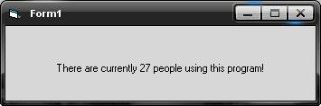



## Show how many people are using your program

### Description

This code will get the amount of people that are using your program and display it on your program. You need a server with php enabled. Bug fix 28 march 2008.
 
### More Info
 

             |
---                |---
**Submitted On**   |2007-12-12 10:23:52
**By**             |[Webmonster](https://github.com/Planet-Source-Code/PSCIndex/blob/master/ByAuthor/webmonster.md)
**Level**          |Beginner
**User Rating**    |4.0 (24 globes from 6 users)
**Compatibility**  |VB 6\.0
**Category**       |[Miscellaneous](https://github.com/Planet-Source-Code/PSCIndex/blob/master/ByCategory/miscellaneous__1-1.md)
**World**          |[Visual Basic](https://github.com/Planet-Source-Code/PSCIndex/blob/master/ByWorld/visual-basic.md)
**Archive File**   |[Show\_how\_m2107753282008\.zip](https://github.com/Planet-Source-Code/webmonster-show-how-many-people-are-using-your-program__1-69752/archive/master.zip)

